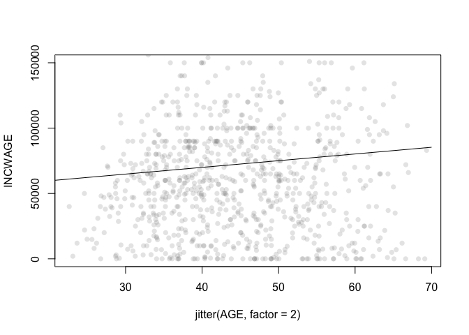
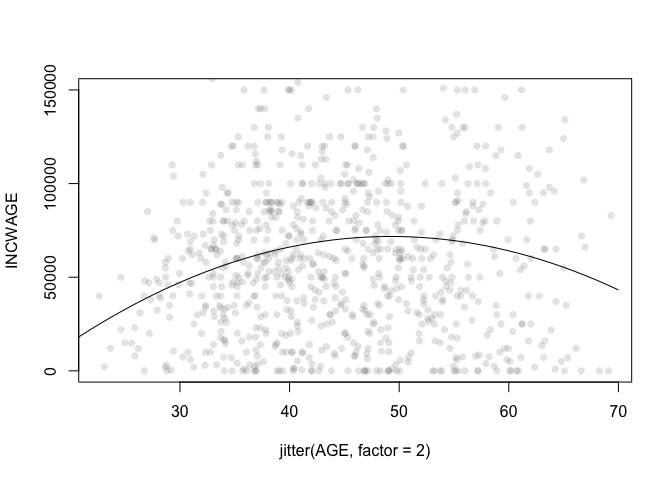
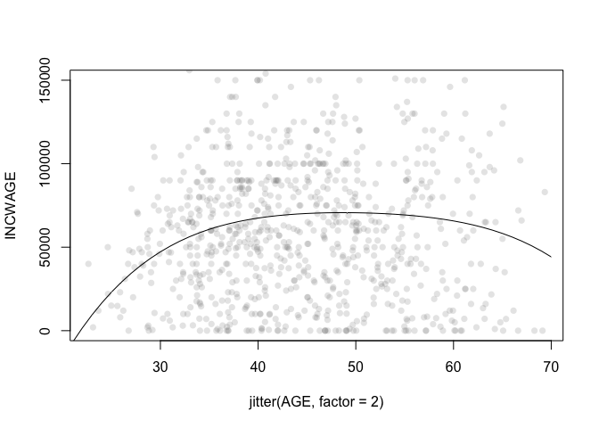
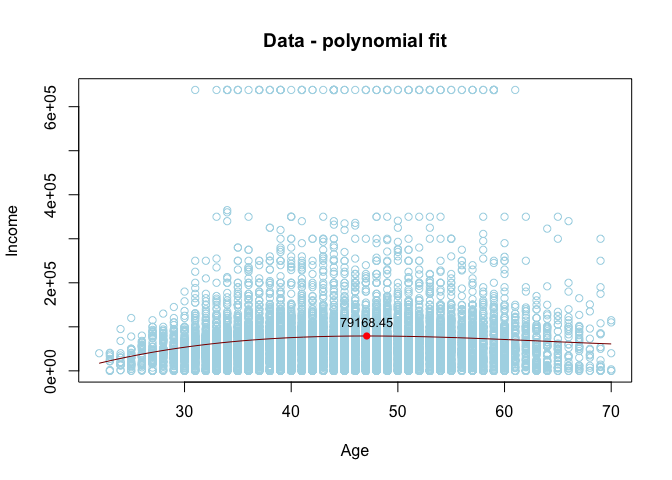

Lab5
================
Isabela Vieira
10/26/2020

``` r
load("~/Documents/College/Fall 2020/Econometrics/acs2017_ny_data.RData")
attach(acs2017_ny)
use_varb <- (AGE >= 20) & (AGE <= 70) & (LABFORCE == 2) & (NCHILD >= 1) & (female == 1) & ((educ_college == 1) | (educ_advdeg == 1)) #I chose to expand the age constraint so I can have more observations in my dat_use
dat_use <- subset(acs2017_ny,use_varb) #I want to see women with at least a college degree who have at least 1 child
#Note I deleted the constraints for hours/weeks worked, because we also want to account for unemployed women who are in the work force
attach(dat_use)
```

    ## The following objects are masked from acs2017_ny:
    ## 
    ##     AfAm, AGE, Amindian, ANCESTR1, ANCESTR1D, ANCESTR2, ANCESTR2D,
    ##     Asian, below_150poverty, below_200poverty, below_povertyline, BPL,
    ##     BPLD, BUILTYR2, CITIZEN, CLASSWKR, CLASSWKRD, Commute_bus,
    ##     Commute_car, Commute_other, Commute_rail, Commute_subway, COSTELEC,
    ##     COSTFUEL, COSTGAS, COSTWATR, DEGFIELD, DEGFIELD2, DEGFIELD2D,
    ##     DEGFIELDD, DEPARTS, EDUC, educ_advdeg, educ_college, educ_hs,
    ##     educ_nohs, educ_somecoll, EDUCD, EMPSTAT, EMPSTATD, FAMSIZE,
    ##     female, foodstamps, FOODSTMP, FTOTINC, FUELHEAT, GQ,
    ##     has_AnyHealthIns, has_PvtHealthIns, HCOVANY, HCOVPRIV, HHINCOME,
    ##     Hisp_Cuban, Hisp_DomR, Hisp_Mex, Hisp_PR, HISPAN, HISPAND,
    ##     Hispanic, in_Bronx, in_Brooklyn, in_Manhattan, in_Nassau, in_NYC,
    ##     in_Queens, in_StatenI, in_Westchester, INCTOT, INCWAGE, IND,
    ##     LABFORCE, LINGISOL, MARST, MIGCOUNTY1, MIGPLAC1, MIGPUMA1,
    ##     MIGRATE1, MIGRATE1D, MORTGAGE, NCHILD, NCHLT5, OCC, OWNCOST,
    ##     OWNERSHP, OWNERSHPD, POVERTY, PUMA, PWPUMA00, RACE, race_oth,
    ##     RACED, RELATE, RELATED, RENT, ROOMS, SCHOOL, SEX, SSMC, TRANTIME,
    ##     TRANWORK, UHRSWORK, UNITSSTR, unmarried, veteran, VETSTAT,
    ##     VETSTATD, white, WKSWORK2, YRSUSA1

1.  First, let’s run a linear regression and see if there is any
    correlation between the Income Wage (dependable variable) and Age.

<!-- end list -->

``` r
model_1 <- lm((INCWAGE ~ AGE )) #Creates a linear regression model.

require(stargazer)  
```

    ## Loading required package: stargazer

    ## 
    ## Please cite as:

    ##  Hlavac, Marek (2018). stargazer: Well-Formatted Regression and Summary Statistics Tables.

    ##  R package version 5.2.2. https://CRAN.R-project.org/package=stargazer

``` r
stargazer(model_1, type = "text") #Nice Textual Analysis of the model.
```

    ## 
    ## ===============================================
    ##                         Dependent variable:    
    ##                     ---------------------------
    ##                            INCWAGE ~ AGE       
    ## -----------------------------------------------
    ## AGE                         513.130***         
    ##                              (86.300)          
    ##                                                
    ## Constant                   49,434.720***       
    ##                             (3,905.250)        
    ##                                                
    ## -----------------------------------------------
    ## Observations                   8,899           
    ## R2                             0.004           
    ## Adjusted R2                    0.004           
    ## Residual Std. Error   76,535.850 (df = 8897)   
    ## F Statistic          35.353*** (df = 1; 8897)  
    ## ===============================================
    ## Note:               *p<0.1; **p<0.05; ***p<0.01

``` r
NNobs <- length(INCWAGE)
set.seed(12345) 
graph_obs <- (runif(NNobs) < 0.1)
dat_graph <-subset(dat_use,graph_obs)  

plot(INCWAGE ~ jitter(AGE, factor = 2), pch = 16, col = rgb(0.5, 0.5, 0.5, alpha = 0.2), ylim = c(0,150000), data = dat_graph)

to_be_predicted1 <- data.frame(AGE = 20:70, female = 1, educ_college = 1, educ_advdeg = 1)
to_be_predicted1$yhat <- predict(model_1, newdata = to_be_predicted1)

lines(yhat ~ AGE, data = to_be_predicted1)
```

<!-- -->

Now, in model\_1 we see that there is indeed a statistically significant
evidence to reject the null hypothesis that there is no relationship
between income and age. We see that p-value is smaller than 0.01, giving
us a nice 99% confidence interval. Looking at the graph, we can see that
there is a positive correlation between the variables, meaning that the
older one gets the higher it’s wage. However, this is a linear model,
and doesn’t really account for the true picture of wage oscilations
given an individual’s age, nothing in real life is truly linear, this is
just an interpretation of a trend in the data.

2.  Now, we will perform a quadratic regression. For this model we will
    also add the marital status of these women. For the predicted data,
    we wan’t to predict single/never maried women only - remember that
    our choosen dataset has only women with at least one child. This
    will be a very specific regression of single-moms in the labor
    force.

<!-- end list -->

``` r
model_2 <- lm((INCWAGE ~ AGE + I(AGE^2) + MARST))

require(stargazer)  
stargazer(model_2, type = "text")
```

    ## 
    ## ===================================================
    ##                           Dependent variable:      
    ##                     -------------------------------
    ##                     INCWAGE ~ AGE + I(AGE2) + MARST
    ## ---------------------------------------------------
    ## AGE                          6,518.609***          
    ##                                (730.597)           
    ##                                                    
    ## I(AGE2)                       -66.192***           
    ##                                 (8.002)            
    ##                                                    
    ## MARST                        -1,875.623***         
    ##                                (511.770)           
    ##                                                    
    ## Constant                    -77,480.130***         
    ##                              (16,334.140)          
    ##                                                    
    ## ---------------------------------------------------
    ## Observations                     8,899             
    ## R2                               0.014             
    ## Adjusted R2                      0.014             
    ## Residual Std. Error     76,158.150 (df = 8895)     
    ## F Statistic            42.057*** (df = 3; 8895)    
    ## ===================================================
    ## Note:                   *p<0.1; **p<0.05; ***p<0.01

``` r
NNobs <- length(INCWAGE)
set.seed(12345) 
graph_obs <- (runif(NNobs) < 0.1)
dat_graph <-subset(dat_use,graph_obs)  

to_be_predicted2 <- data.frame(AGE = 20:70, female = 1, educ_college = 1, educ_advdeg = 1, MARST = 6)
to_be_predicted2$yhat <- predict(model_2, newdata = to_be_predicted2)

plot(INCWAGE ~ jitter(AGE, factor = 2), pch = 16, col = rgb(0.5, 0.5, 0.5, alpha = 0.2), ylim = c(0,150000), data = dat_graph)

lines(yhat ~ AGE, data = to_be_predicted2)
```

<!-- -->

For this model, we again see a positive correlation between income and
age, but a negative correlation between the marital status, meaning that
if single mom (MARST = 6) the wage tends to be lower. Adding the
quadratic formula shows a non-linear trend that probabily better
represents the reality - wages tend to increase at a fast rate between
the ages of 20 and 40, with only slight increases between 40 and 50,
only to decrease after, I want to say, 50. Later on we will be
conducting a regression in which we can find that inflection point.

This makes way more sense than the previous simple linear regression we
ran. It’s very counterintuitive that wages would keep increasing after
one’s retirement. By adding the quadractic function, we see how that
isn’t true.

Also, worths noting that for the quadratic model we still have
statistically significant evidences for rejecting null hypothesis.

3.  Now, let’s see what happens once we add Age^3 & Age^4:

<!-- end list -->

``` r
model_3 <- lm((INCWAGE ~ AGE + I(AGE^2)+ I(AGE^3)+ I(AGE^4)+ MARST ))

require(stargazer)  
stargazer(model_3, type = "text")
```

    ## 
    ## =======================================================================
    ##                                     Dependent variable:                
    ##                     ---------------------------------------------------
    ##                     INCWAGE ~ AGE + I(AGE2) + I(AGE3) + I(AGE4) + MARST
    ## -----------------------------------------------------------------------
    ## AGE                                    39,988.660**                    
    ##                                        (20,101.870)                    
    ##                                                                        
    ## I(AGE2)                                 -1,133.699*                    
    ##                                          (684.796)                     
    ##                                                                        
    ## I(AGE3)                                   14.642                       
    ##                                          (10.124)                      
    ##                                                                        
    ## I(AGE4)                                   -0.073                       
    ##                                           (0.055)                      
    ##                                                                        
    ## MARST                                  -1,777.037***                   
    ##                                          (513.674)                     
    ##                                                                        
    ## Constant                              -457,622.900**                   
    ##                                        (216,051.600)                   
    ##                                                                        
    ## -----------------------------------------------------------------------
    ## Observations                               8,899                       
    ## R2                                         0.015                       
    ## Adjusted R2                                0.014                       
    ## Residual Std. Error               76,145.620 (df = 8893)               
    ## F Statistic                      26.228*** (df = 5; 8893)              
    ## =======================================================================
    ## Note:                                       *p<0.1; **p<0.05; ***p<0.01

``` r
NNobs <- length(INCWAGE)
set.seed(12345) 
graph_obs <- (runif(NNobs) < 0.1)
dat_graph <-subset(dat_use,graph_obs)  

to_be_predicted3 <- data.frame(AGE = 20:70, female = 1, educ_college = 1, educ_advdeg = 1, MARST = 6)
to_be_predicted3$yhat <- predict(model_3, newdata = to_be_predicted3)

plot(INCWAGE ~ jitter(AGE, factor = 2), pch = 16, col = rgb(0.5, 0.5, 0.5, alpha = 0.2), ylim = c(0,150000), data = dat_graph)

lines(yhat ~ AGE, data = to_be_predicted3)
```

<!-- -->

For our 3rd model, we see that we now have a greater level of
representativity in our model. We still are able to see the steep
increase in wages between the ages of 20 and 40, however, we see that
the steep decrease in wages only comes after 65+ in age. I don’t quite
understand why this happens, maybe the model isn’t accounting for the
individuals who chose to retire because we are only accounting for
people in the workforce (labforce == 2 in dat\_use). We see that there
is an increase in the p-value for age^3 and age^4, which means that
these polynomial variables are less statistically significant then the
normal age and age^2. I think this happens because we are making the age
numbers really high while MARST (single-digit variable ) and INCWAGE are
kept at normal.

Answering the question: “What is the peak of predicted wage?”

I understand that we need to compute d WAGE/ d AGE to find the peak of
the parabola. I found a piece of code that helped me to do that using
R:

``` r
Poly_Model <- lm(INCWAGE ~ poly(AGE,3, raw=TRUE), data=dat_use)  # Note use of raw=TRUE, otherwise poly returns orthogonal polynomials
 #Here I'm using only Wage and Age, without MARST. Note also that I used a different function to recreate I(AGE^2) + I(AGE^3), it works in the same way, I tested both with this code. This one just makes the line prettier.  

# Plot data points - that's a different way of plotting the regression, I liked it and thought it was prettier
with(dat_use, plot(AGE, INCWAGE, col="lightblue", ylim=c(0, max(INCWAGE)), 
                xlab = "Age", ylab = "Income", main="Data - polynomial fit"))

# Add model
AGE = seq(min(AGE), max(AGE), length=1000)
pred = data.frame(AGE,
                  INCWAGE=predict(Poly_Model, newdata=data.frame(AGE)))

with(pred, lines(AGE, INCWAGE, col='darkred', type='l', cex=10))

# Vector of model coefficients
cf = coef(Poly_Model)

# First derivative of my poly_model
# This is the "raw" equation but we'll find its roots to get the locations of local maxima and minima.
D1 = cf[2] + 2*cf[3]*pred$AGE + 3*cf[4]*pred$AGE^2

# Roots of first derivative (these are locations where first derivative (d WAGE/ d AGE) = 0).
# Use quadratic formula to find roots (I honestly copied and pasted this formula, but I understand what it's doing)
D1roots = (-2*cf[3] + c(-1,1)*sqrt((2*cf[3])^2 - 4*3*cf[4]*cf[2]))/(2*3*cf[4])

# Second derivative at the two roots. 
D2atD1roots =  2*cf[3] + 6*cf[4]*D1roots

# Local maxima are where the second derivative is negative
max_x = D1roots[which(D2atD1roots < 0)]
max_y = cf %*% max_x^(0:3)

# Plot local maxima
points(max_x, max_y, pch=16, col="red")

# Add values of Yield at local maxima
text(max_x, max_y, label=round(max_y,2), adj=c(0.5,-1), cex=0.8)
```

<!-- -->

This graph shows us that the maximum average wage of this population
(Women with at least a college degree and 1 child, who are in the labor
force) is $79,168 and it occurs around the age of 47-48 years-old. After
that age, we see a very slight decrease in the wage. This graph shows a
curve that is pretty similar to the graphs we plotted while adding MARST
to the regression. That might indicate that there is a strong
relationship between the variables wage and age, and that even after
using a third variable such as MARST the trend of wage peeking at
middle-age women and decreasing as they get older is preserved - well at
least for this very specific population.

``` r
require(stargazer)  
stargazer(Poly_Model, type = "text")
```

    ## 
    ## =====================================================
    ##                               Dependent variable:    
    ##                           ---------------------------
    ##                                     INCWAGE          
    ## -----------------------------------------------------
    ## poly(AGE, 3, raw = TRUE)1        14,984.320***       
    ##                                   (4,156.944)        
    ##                                                      
    ## poly(AGE, 3, raw = TRUE)2         -253.396***        
    ##                                    (92.602)          
    ##                                                      
    ## poly(AGE, 3, raw = TRUE)3           1.335**          
    ##                                     (0.670)          
    ##                                                      
    ## Constant                        -203,921.100***      
    ##                                  (60,577.290)        
    ##                                                      
    ## -----------------------------------------------------
    ## Observations                         8,899           
    ## R2                                   0.013           
    ## Adjusted R2                          0.013           
    ## Residual Std. Error         76,198.660 (df = 8895)   
    ## F Statistic                38.861*** (df = 3; 8895)  
    ## =====================================================
    ## Note:                     *p<0.1; **p<0.05; ***p<0.01

Using stargarzer to provide a summary of the relationship between the
dependable variable INCWAGE and AGE, AGE ^ 2, AGE ^ 3, we see that there
is a relevant statistical relationship between the variables. As we add
more polynomials (Age^3, Age^4) the tendency is that the p-value
increases, which makes sense because we are elevating age to very high
numbers that might not express the same level of significance in
relationship to the income wage variable. The same thing happened for
our model\_3, in which age was more statistically significant than age^2
age^3 age^4.
